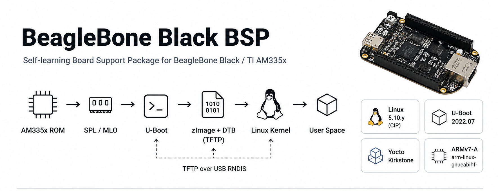
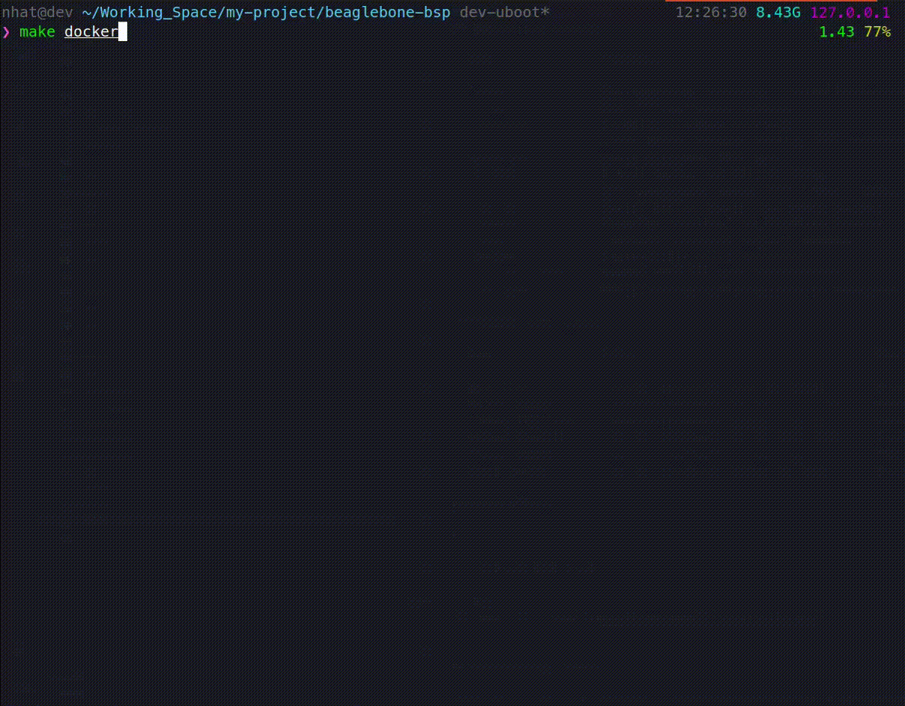
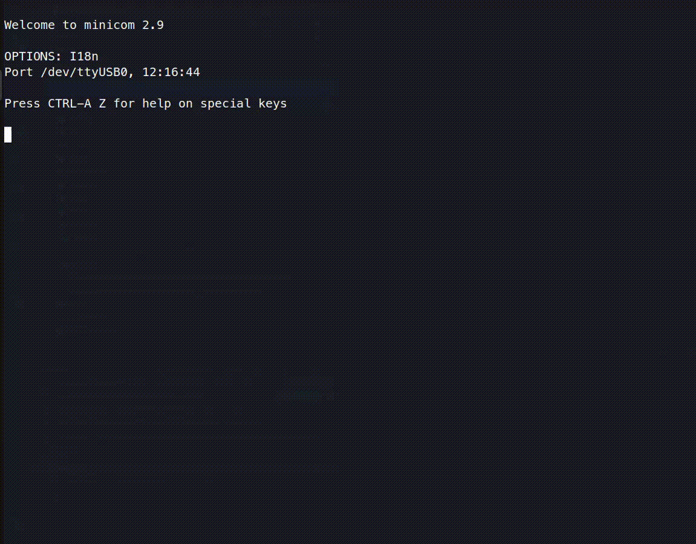

# BeagleBone Black BSP

> Self-learning BSP workspace for BeagleBone Black / TI AM335x.
> This repository tracks the full board support workflow: bootloader, kernel and device
> tree, out-of-tree drivers, Yocto BSP packaging, build/deploy scripts, debug/test scaffolding, and
> an Obsidian-compatible engineering wiki.



**Target**: AM335x (BeagleBone Black), ARMv7-A, `arm-linux-gnueabihf-`

**Stack**: Linux 5.10.y-cip practice baseline, U-Boot 2022.07, Yocto Kirkstone, FreeRTOS scaffold

## Current Status

| Area                   | Status  | Notes                                                                                                             |
| ---------------------- | ------- | ----------------------------------------------------------------------------------------------------------------- |
| Foundation / Toolchain | Done    | Docker build image and top-level Makefile targets are present.                                                    |
| U-Boot                 | Done    | U-Boot 2022.07 tree includes `am335x_boneblack_custom_defconfig`; BSP patches live under `patches/u-boot/`.       |
| Linux Kernel / DTS     | Planned | Linux tree includes custom config fragments and `am335x-boneblack-custom.dts`; BSP patches live under `patches/`. |
| Drivers                | Planned | Driver workspace is in place for BSP modules, with implementation and source completion in progress..             |
| Yocto BSP Layer        | Planned | `meta-bbb` has machine, image, kernel bbappend, driver recipes, and app recipes; some recipe sources are empty.   |
| Userspace Apps         | Planned | `apps/` exists as a workspace; no app source is currently populated.                                              |
| FreeRTOS               | Planned | `freertos/` exists as a firmware workspace; no source is currently populated.                                     |
| Tests / Debugging      | Planned | Debug helper files are present; `tests/` is currently reserved.                                                   |
| Wiki                   | Planned | `vault/wiki/` is the maintained project knowledge base.                                                           |

## Prerequisites

- Docker installed on the host.
- A Yocto `poky` checkout under `$(HOME)/Working_Space/poky` for `make yocto-shell` and `make bitbake`.
- Optional host tools for manual work: `arm-linux-gnueabihf-*`, `cppcheck`, `shellcheck`, `minicom`, `tftpd-hpa`.

## Boot Flow

```text
AM335x ROM -> SPL/MLO -> U-Boot -> Linux zImage + DTB
```

Current development boot flow:

```text
Host TFTP server
  -> zImage
  -> am335x-boneblack-custom.dtb
  -> U-Boot loads both into RAM
  -> bootz ${loadaddr} - ${fdtaddr}
  -> Linux starts
```

The current U-Boot script loads the kernel and DTB into RAM. It does not write them to the SD card.

## Build Artifacts

`scripts/build.sh` copies successful outputs into `build/`:

| Target                      | Output                                                            |
| --------------------------- | ----------------------------------------------------------------- |
| `make kernel`               | `build/kernel/zImage`, `build/kernel/am335x-boneblack-custom.dtb` |
| `make uboot`                | `build/uboot/MLO`, `build/uboot/u-boot.img`                       |
| `make driver DRIVER=<name>` | `build/drivers/<name>/*.ko`                                       |
| `make deploy`               | expects kernel artifacts already in `build/kernel/`               |
| `make flash DEV=/dev/sdX`   | expects boot files already in `build/`                            |

## Safety Notes

`make flash` is destructive. It runs `scripts/flash_sd.sh`, repartitions the target disk
after confirmation, and writes:

- partition 1: 100 MB FAT32 boot partition
- partition 2: ext4 rootfs partition

The flash script only accepts devices matching `/dev/sd*`, refuses devices mounted at
`/` or `/home`, requires root, and prompts for `yes` before writing. You must still
verify `DEV` before running it.

`make deploy` uses `scripts/deploy.sh` and copies `zImage` plus
`am335x-boneblack-custom.dtb` into `TFTP_DIR`, which defaults to `/srv/tftp`.

Do not run flash, deploy, SSH, serial console, or live board commands unless the board
and target device are intentionally connected.

## Repository Layout

| Path             | Purpose                                         |
| ---------------- | ----------------------------------------------- |
| `apps/`          | Userspace app workspace, currently reserved     |
| `drivers/`       | Out-of-tree kernel modules                      |
| `freertos/`      | FreeRTOS firmware scaffold                      |
| `linux/`         | Linux kernel source, configs, DTS, and patches  |
| `meta-bbb/`      | Yocto Kirkstone BSP layer                       |
| `u-boot/`        | U-Boot source and custom config                 |
| `patches/`       | BSP-owned patch queues for U-Boot, Linux, Yocto |
| `scripts/`       | Build, deploy, flash, and debug helpers         |
| `tests/`         | Reserved for local verification scripts         |
| `docs/`          | Technical docs and project roadmap              |
| `docker/`        | Reproducible build container                    |
| `assets/readme/` | README demo GIFs and screenshots                |
| `vault/wiki/`    | Obsidian-compatible engineering knowledge base  |

## README Demo Assets

| Demo             | File                                | Status  |
| ---------------- | ----------------------------------- | ------- |
| Boot flow        | `assets/readme/01-boot-flow.gif`    | Planned |
| Docker build     | `assets/readme/02-docker-build.gif` | Done    |
| U-Boot TFTP boot | `assets/readme/03-uboot-tftp.gif`   | Done    |
| Kernel handoff   | `assets/readme/04-kernel-boot.gif`  | Planned |
| Driver probe     | `assets/readme/05-driver-demo.gif`  | Planned |
| Yocto build      | `assets/readme/06-yocto-build.gif`  | Planned |

Example embed:

2. Docker build

```md

```

3. U-Boot TFTP boot

```md

```

## Engineering Vault

The `vault/wiki/` directory is an Obsidian-compatible knowledge base for this BSP.

It stores:

- Boot flow explanations.
- U-Boot notes.
- Kernel and device tree references.
- Debugging reports.
- Build procedures.
- Hardware references.

## References

- AM335x Technical Reference Manual
- BeagleBone Black System Reference Manual
- U-Boot v2022.07
- Linux 5.10.y / CIP kernel practice baseline
- Yocto Project Kirkstone
- FreeRTOS documentation

## License

See `LICENSE`.
